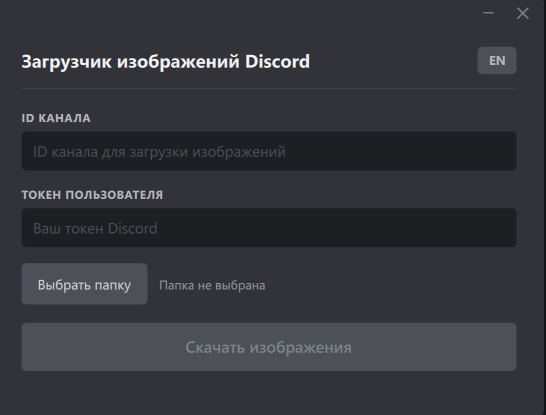
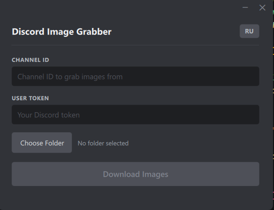

# Discord Image Grabber

[English](#english) | [Русский](#русский)

---

<a name="русский"></a>
## Русский

Десктопное приложение для скачивания всех изображений из канала Discord.

Написано на **Python 3.12+**, **PySide6 (QML)** и **aiohttp**.

### Возможности

- Скачивание всех вложений-изображений из любого канала Discord
- Параллельная загрузка с отображением прогресса
- Сворачивание в системный трей — загрузка продолжается в фоне
- Локализация EN / RU 

### Скриншоты



### Требования

- Python 3.12 и выше
- **User-токен** Discord (не бот-токен)
- **ID канала** Discord

### Установка

```bash
git clone https://github.com/your-username/DiscordChannelImageGrabber.git
cd DiscordChannelImageGrabber

python -m venv .venv
.venv\Scripts\activate        # Windows
# source .venv/bin/activate   # Linux / macOS

pip install -r requirements.txt
```

### Запуск

```bash
cd src
python main.py
```

1. Введите **ID канала**
2. Введите **User-токен** (сохраняется после первой успешной загрузки)
3. Нажмите **Выбрать папку** для выбора места сохранения
4. Нажмите **Скачать изображения**

Окно можно свернуть в трей — загрузка продолжится в фоне, по завершению появится уведомление.

### Как получить токен Discord

> **Используйте на свой страх и риск.** Использование user-токена может нарушать Условия использования Discord.

1. Откройте Discord в браузере
2. Нажмите `F12` → вкладка **Сеть**
3. Отправьте любое сообщение или перезагрузите страницу
4. Найдите запрос к `discord.com/api` → **Заголовки** → `Authorization`

### Структура проекта

```
DiscordChannelImageGrabber/
├── resources.qrc              # Манифест Qt Resource System
├── src/
│   ├── generated/
│   │   └── resources_rc.py   # Скомпилированные QML-ресурсы (pyside6-rcc)
│   ├── qml/
│   │   └── main.qml          # QML-интерфейс (тёмная тема Discord)
│   ├── backend.py             # PySide6 QObject — мост между QML и логикой
│   ├── main.py                # Точка входа (QApplication + QQmlApplicationEngine)
│   ├── scripts.py             # Асинхронный загрузчик изображений (aiohttp)
│   └── strings.py             # Словари локализации EN / RU
├── tests/
│   ├── .env                   # Токен и ID канала для интеграционных тестов
│   ├── conftest.py
│   ├── test_backend.py
│   ├── test_scripts.py
│   └── test_strings.py
├── requirements.txt
└── pytest.ini
```

### Зависимости

| Пакет | Назначение |
|---|---|
| `PySide6` | Qt 6 — GUI, QML, сигналы, QSettings |
| `aiohttp` | Асинхронные HTTP-запросы для получения сообщений и скачивания изображений |


<a name="english"></a>
## English

A desktop application for downloading all images from a Discord channel.

Built with **Python 3.12+**, **PySide6 (QML)** and **aiohttp**.

### Features

- Download all image attachments from any Discord channel
- Concurrent downloads with a real-time progress bar
- System tray support — minimize and keep downloading in the background
- EN / RU localization 

### Screenshots



### Requirements

- Python 3.12 or newer
- A Discord **user token** (not a bot token)
- A Discord **channel ID**

### Installation

```bash
git clone https://github.com/your-username/DiscordChannelImageGrabber.git
cd DiscordChannelImageGrabber

python -m venv .venv
.venv\Scripts\activate        # Windows
# source .venv/bin/activate   # Linux / macOS

pip install -r requirements.txt
```

### Usage

```bash
cd src
python main.py
```

1. Enter the **Channel ID**
2. Enter your **User Token** (saved after the first successful download)
3. Click **Choose Folder** to select where images will be saved
4. Click **Download Images**

The window can be minimized to the system tray — the download continues in the background and a notification appears when it finishes.

### How to get your Discord token

> **Use at your own risk.** Using a user token against Discord's API may violate their Terms of Service.

1. Open Discord in your browser
2. Press `F12` → **Network** tab
3. Send any message or reload the page
4. Find a request to `discord.com/api` → **Headers** → `Authorization`

### Project structure

```
DiscordChannelImageGrabber/
├── resources.qrc              # Qt Resource System manifest
├── src/
│   ├── generated/
│   │   └── resources_rc.py   # Compiled QML resources (pyside6-rcc)
│   ├── qml/
│   │   └── main.qml          # QML UI (Discord dark theme)
│   ├── backend.py             # PySide6 QObject — bridge between QML and logic
│   ├── main.py                # Entry point (QApplication + QQmlApplicationEngine)
│   ├── scripts.py             # Async image downloader (aiohttp)
│   └── strings.py             # EN / RU localization dictionaries
├── tests/
│   ├── .env                   # Token and channel ID for integration tests
│   ├── conftest.py
│   ├── test_backend.py
│   ├── test_scripts.py
│   └── test_strings.py
├── requirements.txt
└── pytest.ini
```

### Dependencies

| Package | Purpose |
|---|---|
| `PySide6` | Qt 6 — GUI, QML, signals, QSettings |
| `aiohttp` | Async HTTP — fetching messages and downloading images |

### License

MIT
